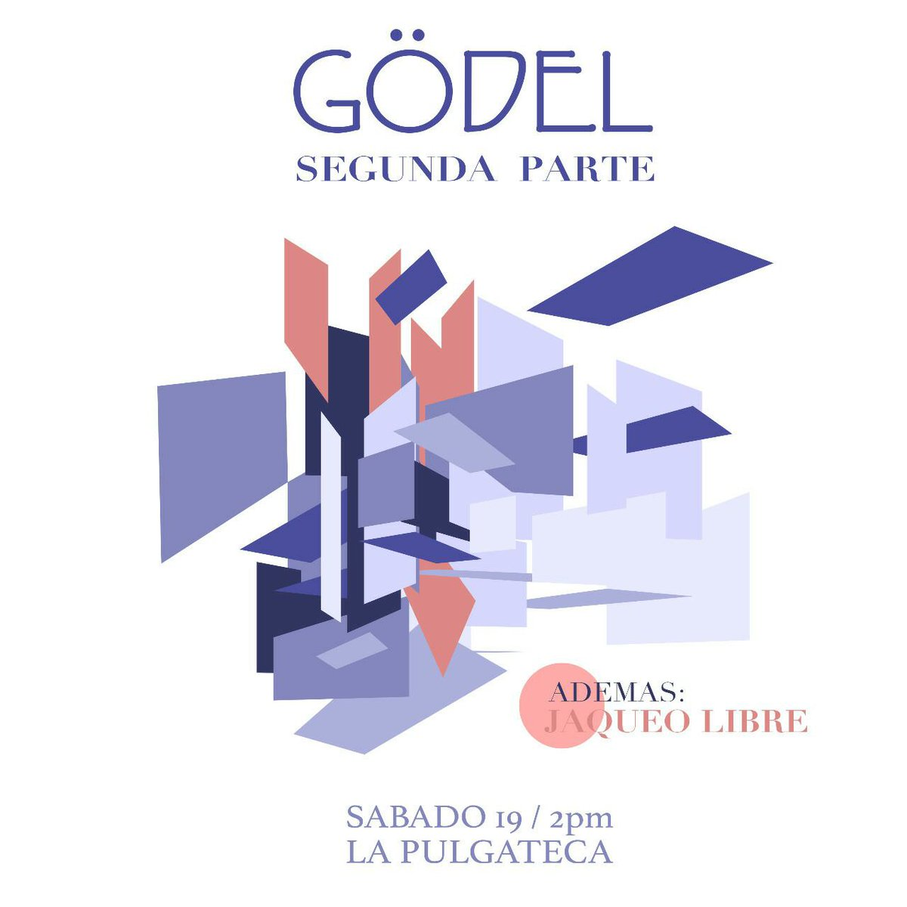

# JáquerEspeises

Eventos del JáquerEspeis y comunidades amigas.

## Pasados

* [2018](2018.md)
* [2017](2017.md)

## 2019

### 20190209

Música electrónica artesanal.

José Duarte.

En la Pulgateca de Casa Canibal, Barrio Escalante, San José.
2 p.m.

### 20190119

Teoremas de incompletitud de Gödel, parte 2.

Claudio Víquez de automata.network

En la Pulgateca de Casa Canibal, Barrio Escalante, San José.
2 p.m.
